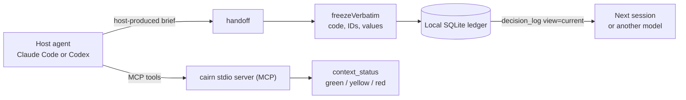

<div align="center">

# 🪨 Cairn

### AI Context Continuity Engine

**A local-private context-handoff tool for long agent sessions.**
Cairn warns you about context rot, preserves decisions + evidence, and hands a
faithful 7-bucket brief to the next session, or the next model.

<br/>

<kbd>MCP stdio</kbd> · <kbd>SQLite Ledger</kbd> · <kbd>Account Mode</kbd> · <kbd>Claude Code</kbd> · <kbd>Codex</kbd> · <kbd>No Telemetry</kbd> · <kbd>Node ≥ 22</kbd>

<br/>

`Cairn resume` &nbsp;·&nbsp; `Cairn Handoff` &nbsp;·&nbsp; `Cairn Help`

**v1.4.0** · MIT License

</div>

---

## ✨ The Problem

Long AI sessions lose first the things that are most expensive to miss later:
architecture decisions, rationale, discarded paths, exact IDs, code and config blocks.
Cairn keeps a local memory **alongside** the agents for exactly this: no backend, no cloud.

| Without Cairn | With Cairn |
|---|---|
| 🌫️ Context fills up, quality degrades unnoticed | 🟢🟡🔴 Zone indicator relative to the active window |
| 🧹 Host compaction loses detail | 📋 7-bucket brief: decisions, evidence, constraints |
| ✂️ Code/IDs get paraphrased | 🔒 Verbatim freeze, byte-exact restoration |
| 🔌 Switching between sessions/models is brittle | 🗄️ Persistent decision/evidence ledger |
| 🕵️ Internal work should stay local | 🏠 stdio + SQLite, no telemetry, no egress |

---

## 🧭 How It All Fits Together



The default path is **account mode**: the host agent writes the handoff brief inside your running
Claude or Codex session. Cairn only **stores and validates** it: **no** server-side
model call, **no** API keys, **no** egress through Cairn.

---

## ⚡ In 30 Seconds

```bash
git clone <repo-url> cairn
cd cairn
npm install
node dist/server.js install      # detects Claude Code + Codex, wires up both best-effort
```

Then just say it in chat:

| Say… | …and the agent does |
|---|---|
| **`Cairn resume`** | Re-inject the ledger (`decision_log view=current`) and continue from it as the source of truth, **without** re-reading the repo |
| **`Cairn Handoff`** | Author a 7-bucket brief from the conversation and persist it to the ledger |
| **`Cairn Help`** | A short reference table of all triggers, tools, and shell commands |

To undo: `node dist/server.js uninstall`

---

## 🧱 Core Principles

| Principle | Meaning |
|---|---|
| **MCP core, no browser capture** | The conversation comes from the host agent: no DOM scraping, no UI adapters. |
| **Fidelity over cost** | Fidelity is primary; cost is only a tiebreaker between equally faithful candidates. |
| **Surface-relative zones** | Percentages against `min(model_max, surface_cap, user_override)`, never against the model maximum. |
| **Respect the host ecosystem** | Only what the active host session can reach is chosen for live use. |
| **Verbatim over poor compression** | Below the fidelity floor, Cairn would rather deliver complete than short and wrong. |
| **Local-private by default** | SQLite file, stdio process, no telemetry, no credentials in standard operation. |

> The binding architecture is documented in [docs/adr/ADR-cairn.md](docs/adr/ADR-cairn.md).

---

## 🛠️ The Four MCP Tools

| Tool | Job | Typical moment |
|---|---|---|
| `host_status` | Detects installed host CLIs, login (best-effort), and the active model. | Start of a session |
| `decision_log` | Re-injects accepted + open decisions from the ledger. | Start / resume |
| `context_status` | Computes the zone relative to the active window. | Ongoing, during long sessions |
| `handoff` | Persists the host-produced 7-bucket brief with verbatim protection. | Before `/clear`, compaction, model switch |

The zones are deliberately simple:

| Zone | Threshold | Meaning |
|:--:|:--:|---|
| 🟢 **Green** | `< 40 %` | Keep working normally |
| 🟡 **Yellow** | `40–70 %` | Plan a handoff at the next natural break |
| 🔴 **Red** | `≥ 70 %` | Prioritize the handoff, prefer the strongest reachable model |

---

## 📋 The 7-Bucket Brief

Every handoff follows the same format:

```text
DECISIONS · EVIDENCE · OPEN QUESTIONS · CONSTRAINTS · VERBATIM · NEXT STEPS · DISCARDED
```

Mandatory values, IDs, paths, code fences, and inline code are passed as `requiredVerbatim` / `exactSpans`.
Cairn masks them with `[[CAIRN-HOLD-n]]` before any optional condensation and restores them
afterward **byte-exact**. A new handoff **supersedes the previous one**, so the ledger stays lean
and `decision_log view=current` carries only the most recent brief.

---

## 🖥️ Codex Ambient Zone & Shell Commands

Codex has no statusline API. Cairn reads the local rollout files **read-only** and shows the
zone ambiently, in the terminal or window title:

```bash
cairn status      # one line, e.g.  🟢 21% ctx · gpt-5.5
cairn window      # live zone strip as a second pane (Windows Terminal / tmux / iTerm2)
cairn tab         # zone in the terminal/tab title · 'cairn stop' ends it
cairn list        # most recently active Codex sessions (pin with --session <uuid>)
```

Details and tmux/zellij snippets: [integration/codex/ambient-zone.md](integration/codex/ambient-zone.md).

---

## 📦 Installation

<details open>
<summary><b>Path A: Self-installer (recommended)</b></summary>

<br/>

Detects Claude Code and Codex best-effort and installs only what makes sense on your system.
Existing configuration is **augmented** via marked blocks or merged JSON sections, no
foreign project files are rewritten.

```bash
npm install
node dist/server.js install
```

</details>

<details>
<summary><b>Path B: Claude Code plugin</b></summary>

<br/>

```text
/plugin marketplace add /ABSOLUTE/PATH/cairn
/plugin install cairn@cairn
```

The plugin ships the MCP server, skill, and hooks. For the full statusline, the
self-installer is still the easiest path.

</details>

<details>
<summary><b>Path C: Manual (Claude Code / Codex)</b></summary>

<br/>

**Claude Code:**

```bash
claude mcp add cairn -- node /ABSOLUTE/PATH/cairn/dist/server.js
```

or as `.mcp.json`:

```json
{
  "mcpServers": {
    "cairn": {
      "type": "stdio",
      "command": "node",
      "args": ["/ABSOLUTE/PATH/cairn/dist/server.js"],
      "env": { "CAIRN_DB": "${HOME}/.cairn/cairn.sqlite" }
    }
  }
}
```

**Codex** in `~/.codex/config.toml`:

```toml
[mcp_servers.cairn]
command = "node"
args = ["/ABSOLUTE/PATH/cairn/dist/server.js"]
startup_timeout_sec = 30
tool_timeout_sec = 60
```

Then append `integration/codex/AGENTS.cairn.md` to `~/.codex/AGENTS.md` and place the skills under
`skills/` into `~/.agents/skills/` or `~/.claude/skills/`. Ready-made snippets are in
[integration/](integration/).

</details>

---

## ⚙️ Configuration

> **Language:** Cairn is English by default. German is selectable at install via
> `cairn install --lang de` (an interactive `Language / Sprache? [en]/de` prompt appears when no
> flag is given), and per-session via the `CAIRN_LANG=en|de` env var (the env var overrides the
> install choice).

| Variable | Effect | Default |
|---|---|---|
| `CAIRN_DB` | Path to the SQLite ledger | `~/.cairn/cairn.sqlite` |
| `CAIRN_ENABLE_MODES` | Additional modes: `sampling`, `bridge`, `api` | `account` only |
| `CAIRN_BRIDGE` | Bridge target: `claude` or `codex` | empty |
| `CAIRN_ENDPOINT_<NAME>` | Explicit API/org endpoint `provider\|baseUrl\|apiKeyEnv\|model` | empty |
| `CAIRN_CODEX_SESSIONS` | Alternative Codex sessions directory | `~/.codex/sessions` |
| `CAIRN_CODEX_SESSION` | Pin a Codex rollout by UUID/path substring | newest matching session |
| `CAIRN_LANG` | Runtime locale: `en` or `de` (overrides the install choice) | `en` |

### Condensation Modes

| Mode | Activation | Egress through Cairn? | Use |
|---|---|:--:|---|
| `account` | Default | **No** | Host agent produces the brief in-session; Cairn only persists it. |
| `bridge` | `CAIRN_ENABLE_MODES=bridge` | yes, local via another CLI | Condensation via the other logged-in account. |
| `sampling` | `CAIRN_ENABLE_MODES=sampling` | client-dependent | MCP sampling, when the host supports it. |
| `api` | `CAIRN_ENABLE_MODES=api` + endpoint | yes | Headless org runs with explicit credentials. |

Without explicit configuration, Cairn **refuses** all non-account paths.

---

## 🔐 Data & Privacy

- Ledger: `~/.cairn/cairn.sqlite` (or `CAIRN_DB`)
- Append-only: decisions are **superseded**, not deleted
- `stdout` stays reserved for MCP
- No backend, no telemetry, no cloud sync
- Default account mode needs **no** API keys and makes **no** model call in the server

---

## 🧪 Development

```bash
npm run typecheck    # tsc --noEmit, strict
npm test             # vitest
npm run build        # tsc -> dist/
npm run dev          # MCP stdio server locally
```

---

## 🗂️ Project Structure

```text
src/
  server.ts       MCP server + CLI dispatch
  core/           model profiles, zones, providers, verbatim
  store/          SQLite ledger (append-only)
  tools/          MCP tool implementations
  surface/        Claude/Codex surface logic
  install/        self-installer + shell shortcuts
skills/           agent skills (cairn · resume · handoff · help)
integration/      manual Claude/Codex configuration + snippets
docs/adr/         binding architecture decisions
```

---

## ✅ Status v1.4.0

- MCP core with four tools + SQLite decision/evidence ledger
- Account mode as the default (no egress)
- Claude Code statusline & hooks · Codex ambient zone via rollout reader
- Named trigger skills: `Cairn resume` · `Cairn Handoff` · `Cairn Help`
- Lean ledger: a new handoff supersedes the previous brief
- Strict TypeScript + Vitest
- English-primary, with selectable German for both commands (`cairn install --lang de`) and runtime output (`CAIRN_LANG=de`)

**Known limits:** zone boundaries are `provisional`; Codex rollout parsing depends on an
internal, unversioned Codex format; login detection is best-effort.

---

## 📄 License

[MIT](LICENSE) © 2026 CheswickDEV
